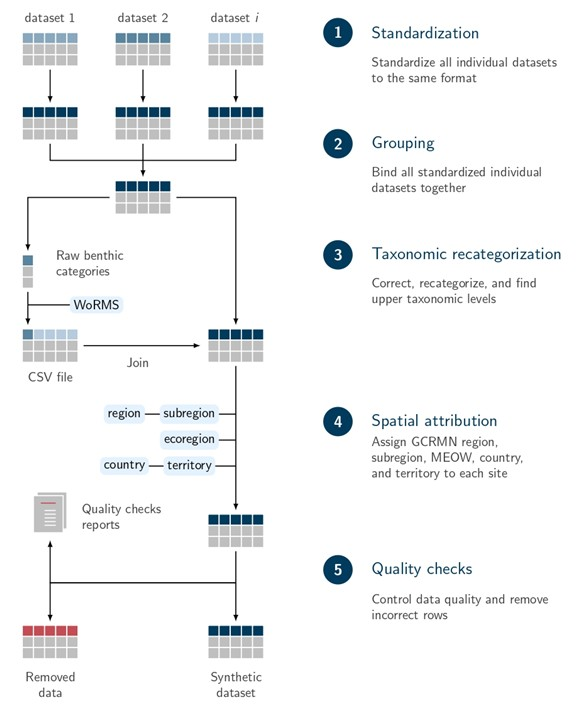
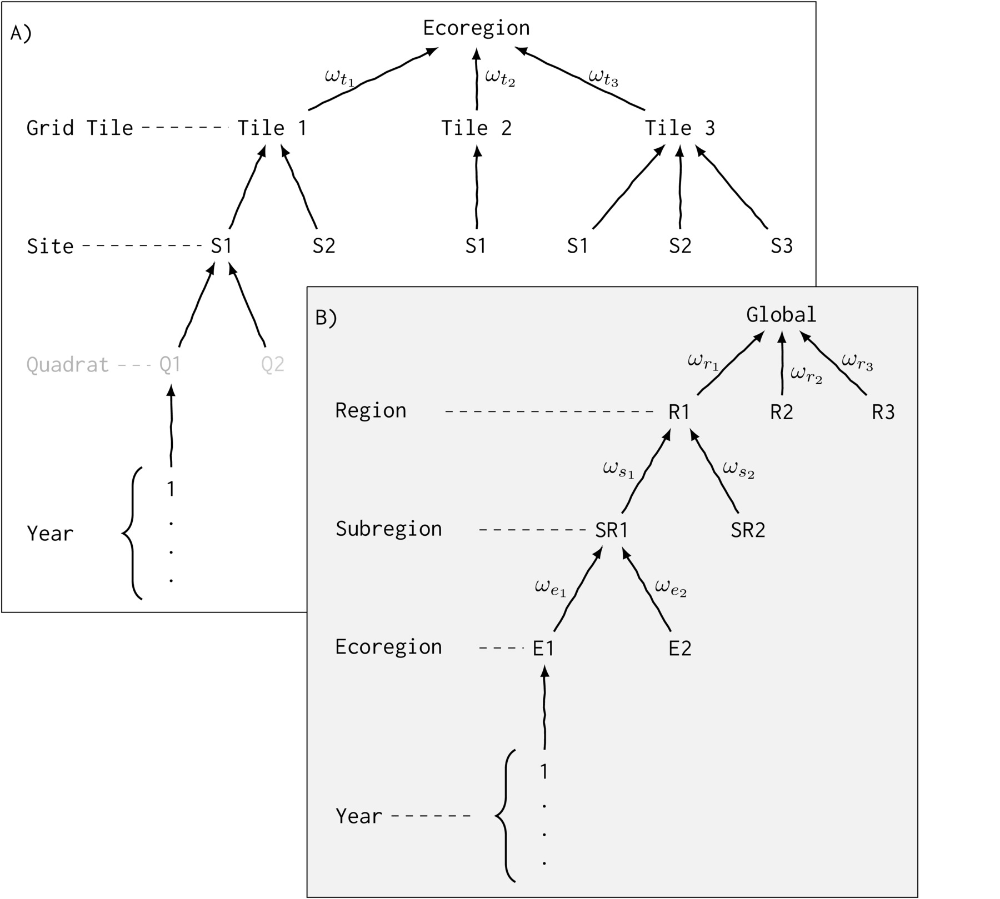
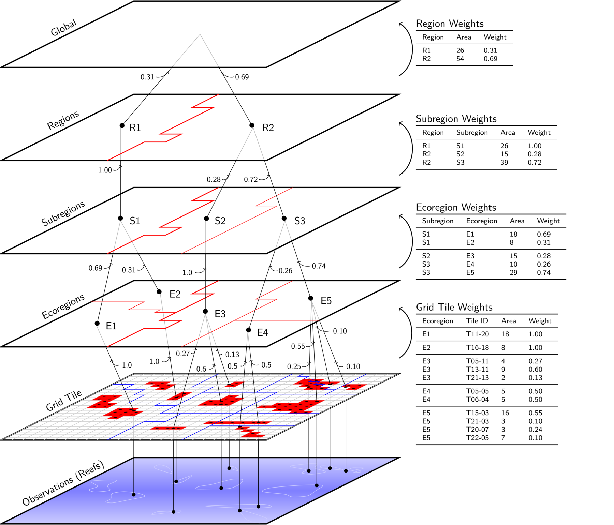
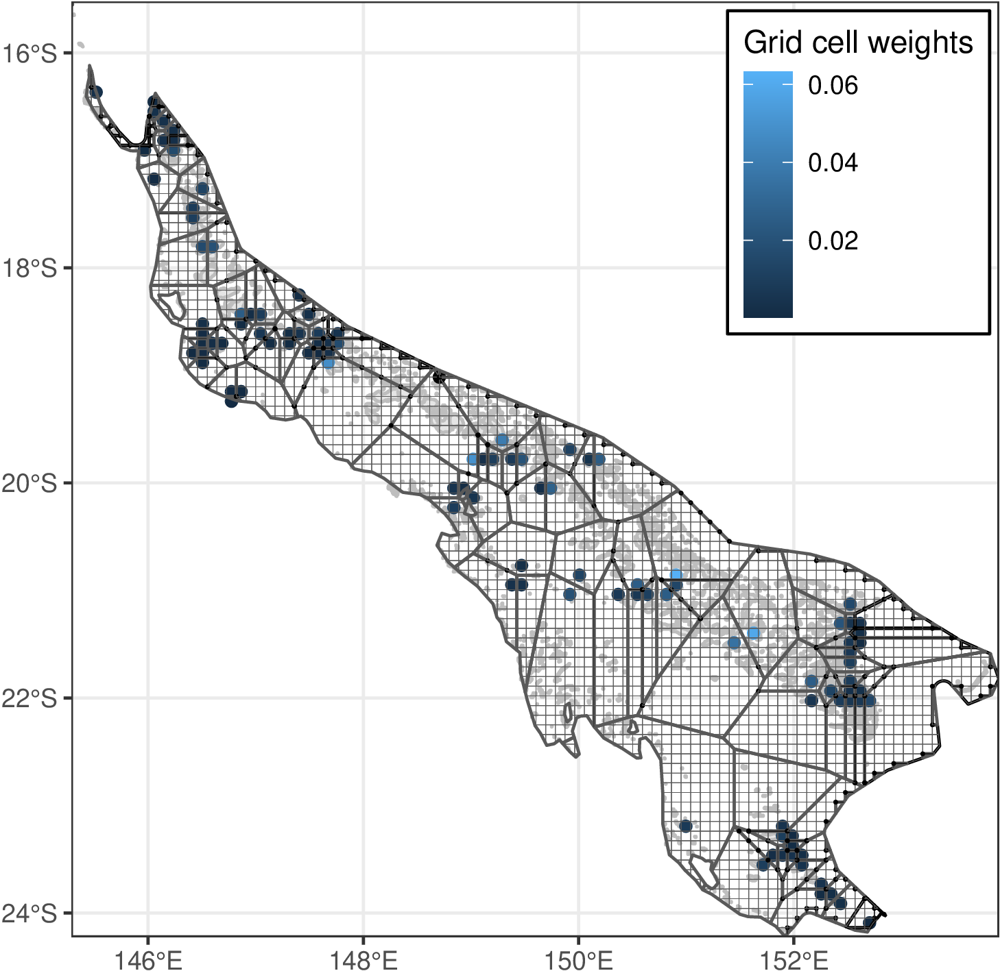

## Data sources

### Regions and subregions

The GCRMN regions and subregions polygons were obtained by combining
the polygons of the Marine Ecoregions Of the World
[@Spalding-2007]. The code used to obtain these polygons is publicly
available at <https://github.com/GCRMN/gcrmn_regions>.

### Coral reef distribution {#sec-coral-reef-distribution}

The Tropical Coral Reefs of the World dataset
[CoralReefsOfTheWorld-2011] developed by the World Resources Institute
(WRI) was used as the coral reef distribution. This dataset consists
of a shapefile of coral reef locations at a 500 m resolution. We
modify the dataset by adding coral reefs in Norfolk Island and by
updating coral reef distribution for the Eastern Tropical Pacific,
where multiple inconsistencies were mentioned by coral reefs experts
in the region.

## Benthic cover indicators

Although numerous ecological variables are measured and monitored
across the world’s coral reefs [@Flower-2017], benthic cover is
arguably the most widely assessed, both spatially and temporally. This
is largely because most benthic cover monitoring methods are
relatively simple, cost-effective, and require limited taxonomic
expertise [@Aronson-1994; @Hill-2004]. Measurements of benthic cover
began prior to 1980 [@Connell-1997; @Dustan-1987], and advances in
survey techniques have had minimal effects on comparability with
historical data. For instance, different approaches such as
point-intercept transects and photo-quadrats generally yield
consistent estimates of benthic cover [@Jokiel-2015].

The comparability of methods enables the integration of datasets from
multiple monitoring programs, allowing temporal trends in benthic
cover to be estimated at large spatial scales. This approach, known as
full data analysis, provides greater precision than other forms of
synthesis such as meta-analyses or systematic reviews
[@Spake-2021]. Unlike meta-analysis, which typically produces a single
effect size, full data analysis facilitates the estimation of complex
temporal dynamics. Furthermore, because it relies directly on raw
data, it incorporates a larger quantity of information than
meta-analyses or systematic reviews, which are constrained to
published results.

Among the wide range of benthic categories used by monitoring
programs, we chose to report five major benthic categories (hard
coral, macroalgae, turf algae, coralline algae, and other
fauna). Unlike the “Status of Coral Reefs of the World: 2020” GCRMN
report [@Souter-2021], we separated algae into three functional
groups - macroalgae, turf algae, and coralline algae (see section
Taxonomic re-categorization, for definitions). This decision was made
to better capture the ecological complexity of coral reefs and to
reflect the distinct functional roles of different algal groups
(Tebbett et al., 2023a).

### Data integration {#sec-data-integration}

A full data analysis of benthic cover in coral reefs is only feasible
when a homogeneous dataset is available. As no such dataset existed at
the global scale, we first conducted a data integration step prior to
analysis. The objective was to construct a consistent synthetic
dataset of coral reef benthic cover by aggregating multiple
heterogeneous individual datasets. This data integration relied on an
improved version of the workflow developed by @Wicquart-2022
for the “Status of Coral Reefs of the World: 2020” GCRMN report
[@Souter-2021]. Key improvements to the workflow included the
addition of quality checks, which provide stronger guarantees of data
reliability. The data integration workflow applied in this report
consists of five main steps, summarized in @fig-3.3 and described in
detail in the following sections.

::: {.figure #fig-3.3}

{width=500px}

Schematic representation of the five main steps of the data
integration workflow used to construct the synthetic dataset on coral
reef benthic cover. MEOW = Marine Ecoregions of the World
[@Spalding-2007].

:::

### Data collation

We recontacted data contributors who had participated in the “Status
of Coral Reefs of the World: 2020” GCRMN report [@Souter-2021] to
obtain authorization for data reuse and to update the datasets they
had previously shared. In parallel, we issued an open call for data
contributions in July 2024. Finally, data collation was complemented
by searching for datasets available in scientific articles, data
papers, and coral reef data platforms (e.g., MERMAID), and by inviting
dataset owners to contribute.

The datasets compiled during the data collation step were
heterogeneous in terms of format (e.g., CSV, Excel), structure,
variable names, and measurement units (e.g., meters vs. feet for
depth). To enable integration into a single homogeneous synthetic
dataset, a data standardization step was required. For each dataset,
we developed an R script to apply dataset-specific modifications
according to a predefined structure and set of variables
(@tbl-1). These modifications included merging Excel spreadsheets,
linking primary datasets with associated metadata (e.g., site
coordinates, benthic codes), selecting and renaming variables,
converting units, harmonizing Coordinates Reference Systems (CRS) and
date formats, and deriving benthic cover values from raw observations
such as point-intercept transects or photo-quadrats (@fig-3.3, Step
1).


| Nb | Variable         | Type      | Description                                          |
|----|------------------|-----------|------------------------------------------------------|
| 1  | datasetID        | Factor    | ID of the dataset                                    |
| 2  | region           | Factor    | GCRMN region                                         |
| 3  | subregion        | Factor    | GCRMN subregion                                      |
| 4  | ecoregion        | Factor    | Marine Ecoregion of the World (Spalding et al, 2007) |
| 5  | country          | Factor    | Country                                              |
| 6  | territory        | Character | Territory                                            |
| 7  | locality         | Character | Site name                                            |
| 8  | habitat          | Factor    | Habitat                                              |
| 9  | parentEventID    | Integer   | Transect ID                                          |
| 10 | eventID          | Integer   | Quadrat ID                                           |
| 11 | decimalLatitude  | Numeric   | Latitude (decimal, EPSG:4326)                        |
| 12 | decimalLongitude | Numeric   | Longitude (decimal, EPSG:4326)                       |
| 13 | verbatimDepth    | Numeric   | Depth (m)                                            |
| 14 | year             | Integer   | Four-digit year                                      |
| 15 | month            | Integer   | Integer month                                        |
| 16 | day              | Integer   | Integer day                                          |
| 17 | eventDate        | Date      | Date (YYYY-MM-DD, ISO 8601)                          |
| 18 | samplingProtocol | Character | Method used to acquire the measurement               |
| 19 | recordedBy       | Character | Person who acquired the measurement                  |
| 20 | category         | Factor    | Benthic category                                     |
| 21 | subcategory      | Factor    | Benthic subcategory                                  |
| 22 | condition        | Character | Condition for hard corals                            |
| 23 | phylum           | Character | Phylum                                               |
| 24 | class            | Character | Class                                                |
| 25 | order            | Character | Order                                                |
| 26 | family           | Character | Family                                               |
| 27 | genus            | Character | Genus                                                |
| 28 | scientificName   | Character | Species                                              |
| 29 | measurementValue | Numeric   | Percentage cover                                     |

: Description of variables included in the gcrmndb_benthos synthetic
dataset. Variable names (except region, subregion, ecoregion,
category, subcategory, and condition) follow [DarwinCore
terms](http://dwc.tdwg..org/terms/). Variables 2-13 correspond to
spatial dimensions, variables 14-17 to temporal dimensions, and
variables 20-28 to taxonomic information {#tbl-1}


All data standardization was performed using R scripts, ensuring
transparency of modifications and allowing for subsequent corrections
if errors are identified. Because all R scripts are publicly
available, dataset owners can also verify the changes applied to their
data (see <https://github.com/GCRMN/gcrmndb_benthos>).

Following standardization, each dataset was exported in CSV format,
and all CSV files were then merged into a single raw synthetic dataset
(@fig-3.3, Step 2).

### Taxanomic re-categorization

During the data standardization step, the raw benthic categories -
those originally defined by the data providers in each dataset - were
stored in the temporary variable organismID. We then used the taxize R
package to automatically retrieve taxonomic information for variables
23 to 28, from the World Register of Marine Species (WoRMS)
database. Subsequently, a CSV file containing all unique raw benthic
categories was exported. Each automatically completed entry was
verified, and any missing taxonomic information was manually added for
variables 20 to 28 (@fig-3.3, Step 3).

When a raw benthic category represented a broad, non-taxonomic
grouping, we completed the variables category and, where possible,
subcategory accordingly. For example, the raw category “turf” was
assigned to category = “Algae” and subcategory = “Turf algae.”

Several specific cases required particular attention during taxonomic
reclassification:

- **Mixed categories**: In this case, we assigned the lowest common
     denominator of the mixed categories. For example, when the raw
     benthic category was “Macroalgae and turf algae,” we classified
     it as “Algae”.

- **Stacked categories**: In this case, we retained the category that
     was above the other. For instance, when the raw benthic category
     was “Algae on dead coral,” we assigned the category to “Algae.”

- **Homonym taxa names**: In this case, we either contacted the data
       provider to replace the ambiguous raw category with a precise
       one during the data standardization step, or we left the
       variable category blank, which subsequently led to the removal
       of the corresponding rows. For example, “Turbinaria” refers
       both to a genus of Scleractinia (corals) and to a genus of
       Fucales (macroalgae). If the data provider was able to clarify
       the intended meaning, the raw category was replaced with a
       specific denomination (e.g., “Turbinaria – Coral”) during the
       standardization step.

- **Unrequired or unintelligible categories**: In this case, we did
     not complete the variable category, which also led to the removal
     of the corresponding rows. Examples include raw benthic
     categories such as “Shadow,” “Other,” or “Unknown.”

When the raw benthic category referred to a taxon (e.g., “Acropora”)
rather than a broad grouping (e.g., “Hard coral”), we completed
variables 23 to 28. To do so, we first verified the spelling of each
raw benthic category using WoRMS and considered updates in taxonomic
classification that may have occurred between the time of data entry
by the providers and the integration process. Within the CSV file, we
then filled in the taxonomic rank corresponding to the raw benthic
category, as well as all higher taxonomic levels (variables 23 to 28
in @tbl-1). For example, for the raw benthic category “coral
acropora,” we entered “Acropora” for the variable genus, “Acroporidae”
for family, and continued this process up to the variable phylum. When
the raw benthic category was taxonomic, the variables category and
subcategory were left empty. These variables were later completed in R
by applying attribution rules derived from the taxonomic variables (23
to 28 in @tbl-1). The rules were as follows:

- **Hard coral**: We assigned category = “Hard coral” when the
     variable order was “Scleractinia” or when the variable family was
     “Milleporidae” or “Helioporidae.” When contributors used the term
     “hard coral” without providing taxonomic information, we also
     assigned category = “Hard coral.” Note that the “Hard coral”
     category excluded dead corals but may have included partially or
     fully bleached corals.

- **Macroalgae**: We assigned category = “Algae” and subcategory =
     “Macroalgae” when the variable class was “Phaeophyceae,”
     “Florideophyceae,” or “Ulvophyceae” and the variable order was
     not “Corallinales.” When contributors used the term “macroalgae”
     without providing taxonomic information, we applied the same
     classification (category = “Algae” and subcategory =
     “Macroalgae”).

- **Coralline algae**: We assigned category = “Algae” and subcategory
     = “Coralline algae” when the variable order was “Corallinales.”
     When contributors used the term “coralline algae” without
     taxonomic detail, we again classified it as category = “Algae”
     and subcategory = “Coralline algae”.

- **Turf algae**: When contributors used the term “turf algae,” we
     assigned category = “Algae” and subcategory = “Turf algae”.

- **Cyanobacteria**: We assigned category = “Algae” and subcategory =
     “Cyanobacteria” when the variable phylum was “Cyanobacteria”.

- **Other fauna**: We assigned category = “Other fauna” when the
     variable phylum was “Porifera,” “Chordata,” “Echinodermata,”
     “Bryozoa,” “Annelida,” “Mollusca,” or “Arthropoda”; when the
     variable order was “Actiniaria,” “Alcyonacea,” “Zoantharia,”
     “Corallimorpharia,” or “Antipatharia”; or when the variable
     subclass was “Octocorallia”.

- **Seagrass**: We assigned category = “Seagrass” when the variable
     phylum was “Tracheophyta”.

Once the recategorization was completed, we merged the table
containing the organismID variable and the newly created variables (20
to 28 in @tbl-1) with the main data table. We then removed the
temporary variable organismID and deleted all rows with missing values
in the variable category. Removing missing values in category did not
affect percentage cover values, although it reduced the total
percentage cover for a sampling unit (e.g., quadrat, transect) to
below 100%. Finally, we aggregated the variable measurementValue by
grouping across all other variables, thereby preventing duplicate
benthic categories within a given sampling unit.

The full recategorization of raw benthic categories into standardized
categories (variables 20 to 28, @tbl-1) is publicly available in
the file “03_tax-recategorisation.csv” on the [gcrmndb_benthos GitHub
repository](https://github.com/GCRMN/gcrmndb_benthos).

### Spatial attribution

Using site coordinates (from the variables decimalLatitude and
decimalLongitude), we added five spatially related variables to the
dataset (@fig-3.3, Step 4). First, we performed a spatial intersection
to assign the GCRMN “region” and “subregion” variables to each site,
using the GCRMN regions shapefile (GCRMN-2024polygons). We then added
the variable ecoregion by intersecting sites with the Marine
Ecoregions of the World dataset [@Spalding-2007]. Finally, we included
the variables country and territory by referencing the fields
SOVEREIGN1 and TERRITORY1 from the World EEZ v12 dataset
[@Flanders-2023]. Because of the limited spatial resolution of the
World EEZ v12 dataset, some sites located near coastlines fell
slightly outside the EEZ polygons. To minimize missing values for
country and territory, we applied a two-step procedure: we first
intersected sites with the World EEZ v12 dataset, then reprocessed
sites with missing values by performing a second intersection with EEZ
polygons buffered by 1 km.

### Quality checks {#sec-quality-checks}

Pooling large volumes of data without adequate verification risks
compromising data quality. Previous studies have shown that
insufficient quality control in large synthetic datasets can lead to
biased interpretations of ecological questions [@Augustine-2024]. To
address this issue, we implemented a dedicated step for data quality
assessment (@fig-3.3, Step 5). We established a set of nine quality
checks, adapted from @Vandepitte-2015 (@tbl-2). Each
quality check was formulated as a question linked to one or more
variables, making them readily translatable into code.

+----+----------------+-----------------------------------------------------------------------------------------------------------------------+
| Nb | Variable       | Question                                                                                                              |
+====+================+=======================================================================================================================+
|1	 |decimalLatitude |Are the latitude and longitude available?                                                                              |
|    |decimalLongitude|                                                                                                                       |	
+----+----------------+-----------------------------------------------------------------------------------------------------------------------+
|2	 |decimalLatitude |Is the latitude within its possible boundaries (i.e. between -90 and 90)?                                              |
+----+----------------+-----------------------------------------------------------------------------------------------------------------------+
|3   |decimalLongitude|Is the longitude within its possible boundaries (i.e. between -180 and 180)?                                           |
+----+----------------+-----------------------------------------------------------------------------------------------------------------------+
|4   |decimalLatitude |Is the site within the coral reef distribution area (100 km buffer)?                                                   |
|    |decimalLongitude|	                                                                                                                      |
+----+----------------+-----------------------------------------------------------------------------------------------------------------------+
|5   |decimalLatitude |Is the site located within a GCRMN region?                                                                             |
|    |decimalLongitude|       	                                                                                                              |
+----+----------------+-----------------------------------------------------------------------------------------------------------------------+
|6   |decimalLatitude |Is the site located within an EEZ (1 km buffer)?                                                                       |
|    |decimalLongitude|                                                                                                                       |
+----+----------------+-----------------------------------------------------------------------------------------------------------------------+
|7   |year            |Is the year available?                                                                                                 |
+----+----------------+-----------------------------------------------------------------------------------------------------------------------+
|8   |measurementValue|Is the sum of the percentage cover of benthic categories within the sampling unit greater than 0 and lower than 100?   |
+----+----------------+-----------------------------------------------------------------------------------------------------------------------+
|9   |measurementValue|Is the percentage cover of a given benthic category (i.e. a row) greater than 0 and lower than 100?                    |
+----+----------------+-----------------------------------------------------------------------------------------------------------------------+

: List of quality checks used for the gcrmndb_benthos synthetic dataset. {#tbl-2}

Because of rounding decimal places, the sum of percentage cover values
for benthic categories within a sampling unit can slightly exceed 100%
[@Razak-2024]. To avoid unnecessary data loss, we normalized
rows where the total percentage cover was between 100 and 101 to a
maximum of 100. This adjustment was applied prior to implementing
quality check 8 (@tbl-2).

We evaluated each quality check as either “True” or “False,” and
removed all rows that failed at least one check. However, correcting
errors is preferable to deleting data, in order to preserve sufficient
data for analysis. To support error correction, we generated summary
reports for each dataset integrated into the synthetic dataset. These
reports detailed the percentage of rows removed per quality check,
allowing us to identify and correct errors by updating the data
standardization code (@fig-3.3, Step 1). For example, a common and
easily corrected error was the inversion of decimalLatitude and
decimalLongitude.

In addition, the individual dataset reports provided descriptive
information such as the proportion of missing values per variable, the
percentage of rows by benthic category and taxonomic level, and the
spatial and temporal distribution of observations.

### Missing zeros 

The original supplied data were mostly positive only
records.  That is, a taxa was only recorded when it was present.  In
many locations, it is very rare for a dataset not to register any
values in a major benthic categories (Hard coral, Algae and
Macroalgae) for each sampling unit (e.g. transect) when a survey is
conducted.  However, in other locations if a particular benthic
category is relatively rare or else in low abundance (e.g. Macroalgae
in some places), if only positive observations are recorded the
compiled data may appear to have only sparse data.  This will result
in a upward bias in the cover estimates (and uncertainty) for this
benthic category.

In order to "fill in" these "missing zeros", we can add zero
percentage cover records at the replicate level (typically transects)
for each absent benthic category within any datasets and years where
it is determined that the transect was surveyed (based on the presence
of other benthic categories).  Implicit in this operation is the
assumption that if a transect was surveyed, observers had the chance
to record each taxa and only did not if it was not present.


## Bayesian hierarchical model

### Modelling considerations

The sampling design of most monitoring programs is typically tailored
somewhere in a spectrum between a configuration of perpetually fixed
sampling sites and a configuration of randomly selected sites,
depending on the purpose, resources and logistics of the program.
Whist fixed sites act as their own baselines over time and thus
provide relatively efficient means for estimating temporal trends, the
resulting estimates are biased towards the selected locations (which
may not be collectively representative of the broader area). By
contrast, a configuration of uniquely random sites each year is less
likely to be biased (hence more representative) and yet usually
requires considerably higher numbers of sites in order to detect
temporal signals from within the noise.

The focus and challenge for the current report is to utilise a
collection of datasets from a large number of disparate monitoring
programs from around the world in order to provide estimates of status
and trends at much broader spatio-temporal scales.

Whenever multiple data sets are integrated together (particularly if
each is used to represent different areas), the issues of
representativeness and bias are exasperated.  Firstly, quantitative
estimates are always driven by sample sizes.  Within any well designed
monitoring program, efforts are made to ensure the design remains
relatively balanced.  However, this is not the case across programs.
Therefore, when aggregating multiple datasets up to a broader scale,
it is important to be able to control for varying samples sizes so as
to minimise the risks of biasing towards the more heavily replicated
data sets.  Moreover, sample size and density does not necessarily
reflect the density and distribution of the underlying landscape.  For
example, in the case of coral reefs, sampling intensity is likely to
be a function of the relative prosperity of the surrounding
populations and proximity to major population centers rather than the
density and distribution of the reefs themselves.

Enormous (and complex) spatio-temporal models that employ full
positional encoding to evaluate the spatial
patterns\footnote{auto-correlative structures} between all possible
pairs of sampling units (sites) have the potential to allow the
transferal of information from the fine, observation level
measurements to the broader levels of this report. By assuming that a
response (such as percentage live hard coral cover) varies
continuously over an entire two-dimensional surface, such models are
potentially able to leverage trends in areas of relatively high sample
density to estimate the trends in neighbouring areas of sparse
sampling density - albeit with greater uncertainty. However such
models proved to be too computationally burdensome and were incredibly
difficult to tune to ensure they yield sensible outcomes. They also
assumed that changes over space were relatively gradual and thus, can
easily smooth over what would otherwise be considered abrupt local
changes. Furthermore, incorporating information about the spatial
distribution of reefs as well as physical barriers to auto-correlative
process are far from trivial.

As an alternative, we explored hierarchical models in which sampling
units are progressively aggregated with their neighbours into larger
and larger units.  For example, neighbouring quadrats are grouped
together into sites, sites into global grid locations (see below) and
so on up to the level of the whole globe.  This represents a
pseudo-spatial model in that although the influence of neighbouring
data does deteriorate along the hierarchy, it does so in increments
relating to group membership rather than as a continuous function of
spatial distance. Hence in the case of an area comprising of ten
sub-areas, each of the sub-areas will share some information with the
other sub-areas even though any one of them might be geographically
closer to a member of another area than most of the sub-areas in its
designated area (the classic nearest vs average neighbour conundrum).
In any case, all attempts to fit full, global hierarchical models with
the very disparate datasets proved very difficult to stabilise.

Instead, smaller hierarchical models (see @fig-schematichierarchy),
fit separately to each MEOW Ecoregion, were integrated together within
a spatially weighted aggregation hierarchy in which individual model
posteriors (annual estimates) were propagated up through the
hierarchy. Although this approach does still have some elements of the
pseudo-spatial hierarchy that permits data poor areas to leverage
patterns off data richer areas, the leveraging is quarantined to
within MEOW Ecoregions where processes are more likely to be
homogeneous and thus the resulting trends are more likely to be
consistent with the observed data. More details about the spatial
weights are discussed in section @sec-weights and the statistical
models are discussed in section @sec-models.


```{tikz}
%| label: fig-schematichierarchy
%| engine: tikz
%| eval: false
%| echo: false
%| class: tikz
%| out-width: 600px
%| fig-cap: Schematic representation of the a) individual MEOW Ecoregion Bayesian modelling hierarchies and b) spatial aggregation hierarchy.  Note the quadrat-level is de-emphasized to highlight that not all data sources include this unit of observation.  The $\omega$ symbolise the use of spatial weights.
%| engine-opts:
%|   template: "resources/tikz-standalone.tex"

\usetikzlibrary{shapes,arrows,shadows,positioning,mindmap,backgrounds,decorations, calc,fit, decorations.pathreplacing,decorations.pathmorphing, shadings,shapes.geometric, shapes.multipart,patterns}

\tikzstyle{labelText} = [font={\fontspec[Scale=1]{inconsolata}}]
\tikzstyle{Messy} = [decorate,decoration={random steps,segment length=3pt, amplitude=0.3pt},thick]
\begin{tikzpicture}[edge from parent/.style={draw,latex-,Messy,anchor=north},
% parent anchor=south, child anchor=north,
level 1/.style={sibling distance = 3cm, level distance = 0.2cm},
level 2/.style={sibling distance = 3cm, level distance = 1.2cm},
level 3/.style={sibling distance = 1.5cm, level distance = 1.5cm},
every tree node/.style={align=north,anchor=north}
]
\draw [fill=black!0] (-7cm,0.2cm) -- ++(12cm,0cm) -- ++(0cm,-9cm) -- ++(-12cm,0cm) -- ++(0cm,9cm);
\node [labelText, anchor=north west] at(-7,0) {a)};
\path
node {}
child {node [labelText] (E1) {Ecoregion} edge from parent[draw=none]
child {node [labelText] (L1) {Tile 1}
child {node [labelText] (S1) {S1}
child {node [labelText,text=black!30] (Q1){Q1}
child {node [labelText] (Y) {
\begin{tabular}{c}
1\\.\\.\\.\\
\end{tabular}
}}
}
child {node [labelText,text=black!20] (Q2){Q2}
}
}
child {node [labelText] {S2}}
edge from parent node [left=1mm] {$\omega_{t_1}$}
}
child {node [labelText] {Tile 2}
child {node [labelText] {S1}}
edge from parent node [right] {$\omega_{t_2}$}
}
child {node [labelText] {Tile 3}
child {node [labelText] {S1}}
child {node [labelText] {S2}}
child {node [labelText] {S3}
}
edge from parent node [right] {$\omega_{t_3}$}
}
};
\draw [anchor=west] ($(L1.west) + (-3.1cm,0)$) node [labelText] (Location) {Grid Tile};
\draw [dashed] (Location) -- (L1);
\draw [anchor=west] ($(Location.west |- S1.center)$) node [labelText] (Site) {Site};
\draw [dashed] (Site) -- (S1);
\draw [anchor=west] ($(Location.west |- Q1.center)$) node [labelText,text=black!30] (Quadrat) {Quadrat};
\draw [dashed,draw=black!30] (Quadrat) -- (Q1);
\draw [anchor=west] (Location.west |- Y.center) node [labelText] (Year) {Year};
\path [draw, Messy,decorate, decoration={brace, amplitude=8pt}] (Y.south west) -- (Y.north west);

\begin{scope}[xshift=4.5cm,yshift=-4.2cm,
level 1/.style={sibling distance = 1cm, level distance = 0.2cm},
level 2/.style={sibling distance = 1.5cm, level distance = 1.2cm},
level 3/.style={sibling distance = 2.0cm, level distance = 1.5cm}
]
\draw [fill=black!5] (-7cm,0.2cm) -- ++(9.0cm,0cm) -- ++(0cm,-9cm) -- ++(-9.0cm,0cm) -- ++(0cm,9cm);
\node [labelText, anchor=north west] at(-7,0) {b)};
\path
node {}
child {node [labelText] (G1) {Global} edge from parent[draw=none]
child{node [labelText] (R1) {R1}
child{node [labelText] (SR1) {SR1}
child{node [labelText] (E1) {E1}
child {node [labelText] (Y) {
\begin{tabular}{c}
1\\.\\.\\.\\
\end{tabular}
}}
edge from parent node [left] {$\omega_{e_1}$}
}
child{node [labelText] (E2) {E2}
edge from parent node [right] {$\omega_{e_2}$}
}
edge from parent node [left] {$\omega_{s_1}$}
}
child{node [labelText] (SR2) {SR2}
edge from parent node [right] {$\omega_{s_2}$}
}
edge from parent node [left] {$\omega_{r_1}$}
}
child{node [labelText] (R2) {R2}
edge from parent node [pos=0.7,right] {$\omega_{r_2}$}
}
child{node [labelText] (R3) {R3}
edge from parent node [right] {$\omega_{r_3}$}
}
};
\draw [anchor=west] ($(R1.west) + (-4.9cm,0)$) node [labelText] (Region) {\begin{minipage}[h]{1.5cm}GCRMN\\ Region\end{minipage}};
\draw [dashed] (Region) -- (R1);
\draw [anchor=west] ($(Region.west |- SR2.center)$) node [labelText] (Subregion) {\begin{minipage}[h]{2cm}GCRMN\\Subregion\end{minipage}};
\draw [dashed] (Subregion) -- (SR1);
\draw [anchor=west] ($(Region.west |- E1.center)$) node [labelText] (Ecoregion) {\begin{minipage}[h]{2cm}MEOW\\Ecoregion\end{minipage}};
\draw [dashed] (Ecoregion) -- (E1);
\draw [anchor=west] (Region.west |- Y.center) node [labelText] (Year) {Year};
\path [draw, Messy,decorate, decoration={brace, amplitude=8pt}] (Y.south west) -- (Y.north west);
\draw [dashed] (Year) -- ($(Y) +(-10mm,0)$);
\end{scope}

\end{tikzpicture}

```

::: {.figure #fig-schematichierarchy}
{width=600px}

Schematic representation of the a) individual MEOW Ecoregion Bayesian
modelling hierarchies and b) spatial aggregation hierarchy.  Note the
quadrat-level is de-emphasized to highlight that not all data sources
include this unit of observation.  The $\omega$ symbolise the use of
spatial weights.
:::


### Spatial hierarchy

The pseudo-spatial hierarchy outlined above necessitates incremental
jumps in scale from the level at which observations are collected up
to the Global (or even regional) scale.  <!--That is, it is necessary
to group the spatial units up incrementally into larger and large
spatial groups (hence the previously described hierarchy).--> If the
jumps are too large, the information (temporal patterns) shared across
neighbouring spatial units might be driven by very different
underlying conditions and thus not appropriate.

The original datasets collated in this study were provided at scales
of either quadrat/transect or spatial aggregations thereof.  These can
be naturally grouped into sites (or individual reefs) as the first
incremental scale jump, however, subsequent increments are less obvious.

There are numerous ways of grouping coral reef locations into broader
geographic areas, or from the other direction, dividing the globe up
spatially. Some candidates include: Exclusive Economic Zones
[@EEZ-2019], Venon Ecoregions [@Veron-2000] or Marine Ecosystems of
the World
[@Spalding-2007]\footnote{https://www.worldwildlife.org/publications/marine-ecoregions-of-the-world-a-bioregionalization-of-coastal-and-shelf-areas}.
Consensus amongst a large panel of coral reef regional representatives
was that Marine Ecosystems of the World (hereafter MEOW) global
classification system were the most appropriate as it has a strong
bio-geographic focus capturing important, community, evolutionary,
dispersal and isolation processes [@Spalding-2007]. The MEOW
Ecoregions were further grouped up into GCRMN sub-regions and regions
(see tables in the Subregion and Region level outputs) and Figures
@fig-schematichierarchy & @fig-schematic) to provide additional
modelling and reporting granularity.

::: {.figure #fig-schematic}
{width=600px}

Schematic diagram illustrating the hierarchical structure relating the
hypothetical observations (bottom layer) to the level of a 10x10km
grid tile, MEOW Ecoregions, GCRMN Regions and Global scale. The grid
tile layer depicts the 10x10km tile containing reef (red) and the
voronoi polygons (blue lines) used to partition area zones of sample
unit influence. The MEOW Ecoregions layer illustrates five fictitious
Ecoregions which are aggregated into two GCRMN Regions in the layer
above. Vertical lines illustrate the aggregation of data along the
hierarchy and the numbers along these paths represent the aggregation
weights (also tabulated).
:::


The jump in spatial scale from Site (reef) to MEOW Ecoregion can be
very large and span a wide range of influential processes and drivers.
We therefore sought an additional intermediate scale.  Such a scale
could be based on collections of reefs or broad communities, however
such information was not universally available.  An intermediate scale
could also be achieved by gridding the globe up into an array (grid)
of cells or tiles or a constant size.  Moreover, the use of grid tiles
provides a way of abstracting away design differences between fixed
and random annual site selections - and thus a mechanism by which
multiple sampling designs can be incorporated in the one model.

### Spatial weights {#sec-weights}

In order to help maximise the chances that the hierarchical
aggregations are reflective of broad spatial patterns and not heavily
biased by sampling effort alone, the aggregations must be weighted by
the proportion of reef area represented by each spatial unit.

Estimating the distribution and quantity of global coral reefs is a
challenging problem.  As is the case with sampling effort consistency
across the globe, the granularity and accuracy of coral reef mapping
varies substantially from region to region, Hence, we sought a
potentially less biased and more uniform method of estimating reef
area.

#### Tropical Coral Reefs of the World

As an alternative to the Allen Atlas, Tropical Coral Reefs of the
World [@Burke-2011; @WRI-2011] digital shapefiles were used to estimate the
amount of coral reef.  The intermediate spatial scale between observed
sites and MEOWs was provided by generating a 10x10km grid of tiles
across the entire globe and assigning a unique identifier to each
tile.

##### Tile level weights

All observed site level locations were assigned to an grid tile on the
basis of nearest neighbour within 10km. To estimate the amount of reef
area within each MEOW that was represented by each of the observed
sites, voronoi polygons were generated from the unique site locations
and overlayed onto the grid (see @fig-voronoi). The reef area
associated with each voronoi cell were then expressed as a proportion
of the total MEOW reef area, thereby representing the relative weight
that each grid tile should carry in the analyses.

::: {.figure #fig-voronoi}
{width=600px}

Illustration of voronoi polygons overlayed on the 10x10km grid and
reefs (grey). Shaded grid tiles represent grid tiles containing
observed sites and hue of the grid tile shading represents the
relative weights (proportion of reef area in each grid tile).
:::


##### Larger scale weights

The weights (relative contributions) of each MEOW Ecoregion in
aggregating up to GCRMN Sub-regions was calculated as the proportion
of MEOW reef area within each GCRMN Sub-region (see @fig-weights).
Similarly, GCRMN Sub-region and Region weights (used in aggregations
to GCRMN Region and Global levels respectively) were calculated from
the respective proportions of reef areas in GCRMN Regions and
Globally.

::: {.figure #fig-weights}
{width=600px}

Illustration of the relative reef area represented by each 10x10km
grid tile within three MEOW Ecoregions. The hue of reef fill is
proportional to the relative area of reef in the MEOW.
:::


### Statistical model {#sec-models}

Live hard coral cover and algal cover were calculated by summing
observation level data across associated taxonomic groupings.

Separate MEOW Ecosystem Bayesian hierarchical models were constructed
within the stan statistical modelling platform [@Carpenter-2017-2017]
via the rstan [@rstan-2025] interface. Each model comprised a model
matrix representing year dumpy coded as cell means contrasts, a model
matrix representing Dataset coded as sum to zero contrasts as well as
varying effects representing the hierarchical structure of Sites
nested within grid tiles ([@fig-schematichierarchy]a).
Weights were also applied to the grid tiles in order to allow the
influence of each grid tile to be proportional to the relative area of
reef each grid tile represented.

Separate models were fitted to explore trends in live hard coral cover
(HCC) and algae cover (A).  In each case, cover was modelled against a
beta distribution (logit link).  Cover values of either 0 or 1 were
first shrunk by 0.01 for compatibility with the beta distribution.
Weakly informative priors were applied to the beta shape parameters as
well as the varying effects parameters and their standard deviations.

In order to impute missing year combinations and smooth over
short-term oscillations in estimates resulting from short-term
fluctuations in sampling designs and data availability, priors on Year
effects (except that associated with the first observed year of data
in a MEOW Ecoregion) were weakly informative normal priors centred
around the posterior of either previous Year (in the case of Years
after the initial observed year) or after (in the case of Years prior
to the initial observed year).  For the initial observed Year,
standard (zero centred) weakly informative priors were applied.

The Dataset effects were included to act as proxies for all the many
and varying ways that different datasets differ including depth,
sampling unit type (quadrats, transects, etc) and observer experience.
Weakly informative normal priors were applied to the Dataset
effects.

The statistical models can be summarised as:

$$
\begin{align}
  \mathbf{Y} &\sim Beta(\mu\phi, (1-\mu)\phi)\\
  logit(\mu) &= \mathbf{\beta_y} \mathbf{X_y} + \mathbf{\gamma_d} \mathbf{X_d} + \omega\mathbf{\gamma_t} Z_t +
    \mathbf{\gamma_s} Z_s + \mathbf{\gamma_r} Z_r\\
  \mathbf{\gamma_t} &= \sigma_t\times z_t\\
  \mathbf{\gamma_s} &= \sigma_s\times z_s\\
  \mathbf{\gamma_r} &= \sigma_r\times z_r\\
  \phi &\sim \Gamma(0.01,0.01)\\
  z_t,z_s,z_r &\sim N(0,1)\\
  \sigma_t,\sigma_s,\sigma_r &\sim t_3(0, 1)\\
  \sigma_y &\sim t_3(0, 0.5)\\ 
  \mathbf{\beta_{y}} &\sim N(\mathbf{y}, \sigma_y)\\ 
  \mathbf{\beta}_{F_y} &\sim N(O_{y}, 1)\\ 
  \mathbf{y} &\begin{cases}
     y<I_y, \sim N(\mathbf{y}_{y+1}, 0.1)\\
     y=I_y, \sim N(\beta_{y+1}, 0.1)\\
     y=D_y, \sim N(\mathbf{y}_{y-1}, \sigma_y)\\
     y=G_{ys}, \sim N((\beta_{y-1} + \mathbf{y}_{y+1})/2, 0.1)\\
     y=G_{y}, \sim N((\mathbf{y}_{y-1} + \mathbf{y}_{y+1})/2, 0.1)\\
     y=G_{ye}, \sim N((\mathbf{y}_{y-1} + \beta_{y+1})/2, 0.1)\\
     y=F_y, \sim N(O_{y}, 0.1)\\
     y>F_y, \sim N(\mathbf{y}_{y-1}, 0.1)
  \end{cases}\\
  \mathbf{\gamma_d} & \sim N(0, 0.1)\\
\end{align}
$$

where: 

- $\mathbf{Y}$ is a vector of the cover of the benthic group
  (e.g. either live hard coral, macroalgae, algae, etc)

- $\mathbf{\beta_y}$ and $\mathbf{X_y}$ represent the effects of Year
  and cell-means (no intercept) Year model matrices respectively.

- $\mathbf{\beta}_{F_y}$ represents the effect of the final observed year

- $\mathbf{\gamma_d}$ and $\mathbf{X_d}$ represent the effects of
  Dataset ID and the associated model matrix such that the $\beta$
  parameters apply to the average Dataset (rather than the first
  level).

- $\mathbf{\gamma_d}$ is mean centered to ensure it sums-to-zero so
  that the $\beta$ parameters apply to the average Dataset (rather
  than the first level).

- $\mathbf{\gamma_g}$, $\mathbf{\gamma_s}$ and $\mathbf{\gamma_r}$ are
  the sum-to-zero varying effects

- $Z_t$, $Z_s$ and $Z_r$ represent the Grid_id, Site and
  Transect/Replicate codes respectively and $\omega$ are the grid-level
  weights.

- $\mathbf{y}$ represents year hyperparameters and $y$ is a year
  iterator.

- $F_y$ and $O_y$ represents the final observed year and associated mean
  observed response within the MEOW Ecoregion.

- $I_{y}$ represents the first observed year within the MEOW Ecoregion

- $D_{y}$ represents the years for which there are observed data

- $G_{ys}$, $G_{y}$ and $G_{ye}$ represent the years marking the start,
  middle and end of a temporal gap within the observed data for the
  MEOW Ecoregion

- Weakly informative priors (on the link scale) are applied to the
  $\sigma$ hyperpriors as well as $\gamma_d$ (dataset effects).

- A weakly informative prior is assigned to the $\beta$ associated with
  the final observed year.  The mean of this prior is based on the
  median of the raw data for the final year and the standard deviation
  of 1 on the logit scale is relatively large. 

- Priors for all other $\beta$ are derived from the $\mathbf{y}
  hyperparameters.

- Since $\mathbf{y}$ are hyperpriors on the expected $\beta$ and are
  based on lags from surrounding estimates, the priors had narrower
  spread so as to offer some regularisation in the expected change in
  cover over a single year.

- Simularly, the prior on the sum-to-zero effect of Dataset ID
  ($\gamma$) was more informative since there were numerous incidences
  in which different Datasets did not overlap in space and/or time.
  Hence without less weak priors, there was a strong possibility of
  the models doubling up on trying to account for differences in
  Datasets, space and time resulting in highly inflated uncertainties.

Estimates of annual benthic cover thereafter comprised of inverse-link
transformed $\beta$ estimates for the years for which there were
observed data and $\mathbf{Y}$ estimates were used to fill in the gaps
(years for which there were no observed data).  This methodology
enabled us to generate cover estimates that were unsmoothed for data
years (thereby permitting rapid change) whilst still providing
estimates of cover during the temporal gaps that transitioned between
the bookends of the gaps and with uncertainty increasing distal to the
bookends.

An alternate version in which annual benthic cover is derived from
inverse-link transformed $\mathbf{y}$ values is also provisioned.  As
this version uses the generative year hyperpriors, it effectively
applies running one-year smooth over the estimates.  

All models were run with 10,000 no-u-turn iterations, a warmup of
5000 and a thinning rate of 10 for each of three chains (each with
random initial values). The adaptive delta was elevated to 0.99 to
reduce the incidences of post-warmup divergences.  Diagnostics
indicated that all chains converged on stable, well mixed posteriors
(Rhat values < 1.05) and low MCMC sample auto-correlation (< 0.2).
The models were run in the STAN probabilistic language [@STAN] via the
cmdstan interface for R 4.5.1 [@R-4.5.1].

### Hierarchical aggregation

The full posteriors for the Year effects (on the logit scale) of each
MEOW Ecoregion were averaged together within each GCRMN Sub-region
([@fig-schematichierarchy]b).  The resulting posteriors were
then summarised by back-transforming to the response scale (inverse
logit transform in the case of beta models) and calculating the means
and highest probability density intervals (80\% and 95\%).  Similarly,
the un-standardised GCRMN Sub-region posteriors were aggregated (with
weights) up to GCRMN Region and then Global level
(see [@fig-schematichierarchy]b & [@fig-schematic]).

### Code availability

All scripts used to pre-process and analyse the data via the Bayesian
Hierarachical models as well as perform aggregations and derived
tables/figures in this report are available at
<https://github.com/open-AIMS/gcrmn_model_alt>.

